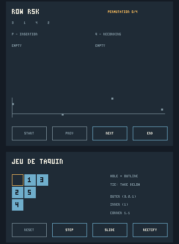

# Idriç application verification

The locally qualified application source is
`1e8e17def5f8cf7f4c7c489b4ba4866ddae6fe7a`. Its published counterpart is
[`1f691ba9b91e2f485a4c4b6feb0f35c857cca843`](https://github.com/isomorphismes/young-tableaux/commit/1f691ba9b91e2f485a4c4b6feb0f35c857cca843).
Both have the exact Git tree `05c56900af888d9064bbbe6d5948d975f3fa3b84`, including
every file byte and mode. The terminal checkout lacked push credentials, so
the connected GitHub app published the same tree with new commit metadata.
Documentation and receipt additions after that source commit do not alter its
`.idric` sources. The retained source manifests make that relationship
independently checkable from the published branch.

## Executed host result

The fresh host qualification completed with `YOUNG_IDRIC_PASS` and **2,383
assertions**. It produced eleven PPM frames, wrote and read back every one, and
retained identical source manifests before and after the run.

| Assertion group | Count |
| --- | ---: |
| Partitions, tableaux, RSK, and jeu de taquin | 57 |
| LR, characters, five exact symmetric bases, plethysm, parser, graph, permutations, and random objects | 1,870 |
| Strict application input grammar | 11 |
| All typed laboratory operations and projections | 142 |
| All laboratory commands and stateful sequences | 194 |
| Rasterization, plots, pointer actions, result paging, pixels, and presentation | 109 |
| **Combined** | **2,383** |

The two additional negative compilation fixtures were refused for their intended
constraints: `StaleFrame` reported the mismatch between `previous` and `current`,
and `InventedFrame` could not solve the constraint between `Raster` and
`Frame source`. Neither produced its checked target module.

The receipt is [host-evidence/receipt.tsv](_/host-evidence/receipt.tsv), with
[actual application output](_/host-evidence/run.stdout), compiler commands and
identities, source hashes, frame hashes, and retained negative diagnostics in
the same directory. A portable source manifest uses paths relative to the
repository root; the original absolute-path manifest is retained separately.

## Executed runtime mutations

Both isolated mutants compiled successfully through the same host backend, then
failed the intended application assertions. Neither emitted the complete
success marker. The unmodified source still matched all 24 manifest entries
afterward.

| Compiling change | Required behavioral witness | Outcome |
| --- | --- | --- |
| Replace the painter's real scene with an empty scene, keeping frame dimensions | `RSK input-to-pixels changes P pane` | Detected; Q, jeu moves, changed-shape plot, scalar result, and page-diagram pixel checks also failed |
| Return the old model instead of the successful action's changed model | `basic actions preserve sequential RSK input and navigation` | Detected; all 44 command/result installation checks also failed |

The qualifier requires these exact witnesses as well as fresh successful
compilation and a nonzero runtime result. A compiler error, missing image
directory, or unrelated file-writing error cannot count as detection. Full
receipts, source and executable hashes, and assertion output are retained under
[mutation-evidence](_/mutation-evidence/).

An initial launcher attempt stopped at Grease's string-concatenation guard
before creating mutant output. The guard was corrected to use ordinary string
interpolation, and the successful executed runner's hash is recorded with the
mutation receipts. This changed the qualifier only; all application `.idric`
sources remained at the qualified commit above.

## Inspecting the pictures

The [interaction animation](previews/interaction.gif) uses actual frames from
the successful qualification: initial state, two RSK insertions, two jeu moves,
and removal of the jeu exit corner. It crops the two control panels from those
frames and loops them in that order. It is a host-output illustration, not a
recording from Android. GIF palette conversion is not used as the pixel oracle.

Lossless PNG previews show [the complete RSK/jeu frame](previews/rsk-and-jeu.png)
and the first two pages of a graph-path result:
[page one](previews/result-page-1.png), [page two](previews/result-page-2.png).
The original PPM files are reproducible through the qualifier and their hashes
are retained. These full PNGs were visually inspected after conversion.

## What each observation establishes

| Observation | Meaning |
| --- | --- |
| Clean compiler diagnostics and fresh Chez executable | The maintained source compiled through the declared host backend |
| Mathematical assertions | The specified ordinary and boundary cases produce their independently checked values |
| All 44 typed and text operations | Each registry operation executes through its declared inputs, returned result, and application state installation |
| Pointer-to-board pixel comparisons | Real production reducer and painter output changes inside the relevant P, Q, or jeu crop; a status label cannot satisfy the assertion |
| Result and page pixel comparisons | Returned scalar data and later diagrams reach the result pane, while all pages retain the complete underlying result |
| File sink readback | The painter's exact output was written and read back successfully on this host |
| Intended frame-type refusals | External code cannot relabel a source-indexed frame or inject an arbitrary raster through the exported interface |
| Compiling runtime mutants rejected by named assertions | Removing model updates or painting causes a relevant behavioral failure; unrelated compile or IO failure does not count |
| Backend positive controls and refusals | The tested target subsets emit their supported controls and reject the documented model/storage/result forms |
| Android window and physical device | Uncompleted; no inference from any host observation |

These are finite checks of the implemented program. Source-indexed frame types
protect the public construction boundary; they do not prove that every possible
painter or mathematical algorithm is correct.

## Reproduction and source identity

Use [the host qualifier](_/qualify-host.grease), then
[the runtime mutant qualifier](_/qualify-mutants.grease), with the arguments
documented in [README.md](README.md). Both require new output directories. The
host qualifier checks source hashes before and after execution. It checks
diagnostics, fresh artifacts, the executed complete marker, and intended
negative diagnostics separately because the inspected compiler can print an
error while returning status zero.

The declared compiler is
`dilapidated-shed/Idric@ff4d852862a3942592f8ade9afde8d409d9803be`, reporting
`Idris 2, version 0.8.0-ff4d85286`, with Chez 10.4.1. The actual Grease used for
qualification came from `dilapidated-shed/grease@ba869518c7d850de6c47d8c6234654575e264e6c`,
material identity `5651cf97a1b5042f24f14112a7ade9a1518eb0bc`; its binary SHA-256 is
`7e31cd05b7a9d8fb2a4a9e003a7f3fcb0159138506d17f0fb28da8cbe22aa85c`.
LeakSanitizer was disabled because it cannot run under this environment's
ptrace; no memory-leak qualification is claimed.

The complete Android application remains blocked. The separate
[native boundary record](native-boundary.md) retains the exact source revisions,
probe commands, refusal diagnostics, positive target artifacts, and independent
DEX parsing. Those probes do not establish ART execution or a posted frame.
